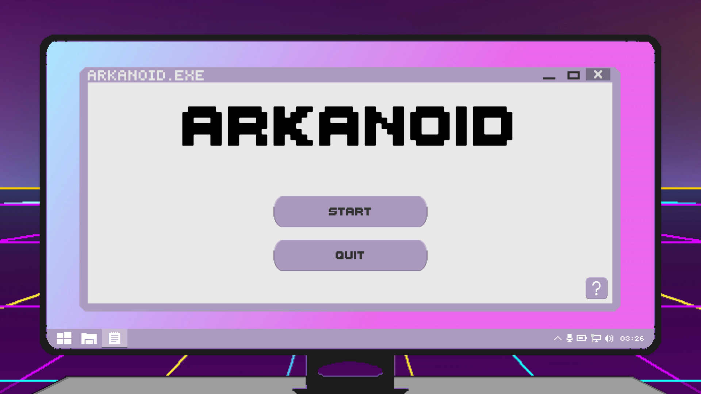
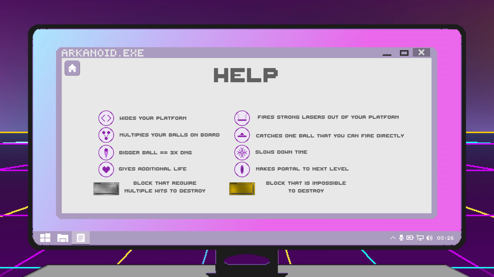
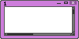
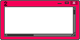
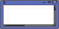
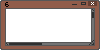
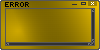
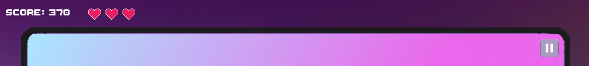
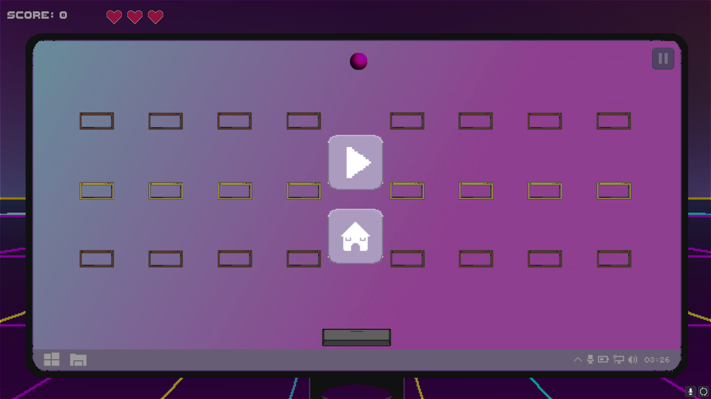

# LimanovArkanoid
## Spis treści

 - [Menu główne](#menu-główne)
 - [Pomoc](#pomoc)
	 - [Power-upy](#power-upy) 
	 - [Bloki](#bloki) 
 - [Sterowanie](#sterowanie)
 - [Interfejs](#interfejs)
 - [Twórcy](#twórcy)
---
## Menu główne

| Przycisk | Opis |
|:--:|--|
||Rozpocznij rozgrywkę | 
||Opuść grę|
||Pomoc|
---
## Pomoc

---
### Power-upy

| Ikona | Opis |
|--|--|
||Rozszerza platformę | 
||Mnoży kulki na planszy|
||Większy rozmiar oraz obrażenia kulki|
||Dodatkowe życie|
||Platforma wystrzeliwuje lasery|
||Złap kulkę, którą możesz wystrzelić|
||Spowolnienie czasu|
||Tworzy portal do następnego etapu|

---
### Bloki
| Blok |Wartość [pkt] |
|--|--|
|| 50 |
||60|
||70|
||80|
||90|
||100|
||50x numer etapu|
||0 - blok niezniszczalny|

---
## Sterowanie
**Platforma podąża za kursorem**  
 

---
## Interfejs

|Ikona|Opis  |
|--|--|
||Ilość żyć  |
||Menu pauzy|
## Menu pauzy

|Ikona|Opis  |
|--|--|
||Wznowienie rozgrywki|
||Powrót do menu głównego|
---
## Twórcy
|Osoba|Rola|
|--|--|
|Igor Jędrzejek |Programowanie|
|Marcin Tomaszek|Programowanie|
|Adam Mąka|Programowanie|
|Mateusz Potoniec|Grafika|
|Marcin Opiela|Muzyka|
